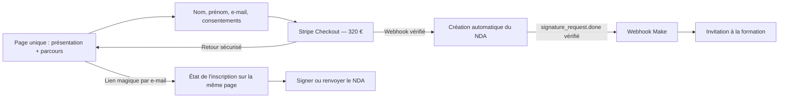

# Portail Formation Déesse Vibes

## Objectif

Créer `formation.deesse-vibes.com`, complément de [`deesse-vibes.com`](https://www.deesse-vibes.com/).

Le site présente brièvement la formation, encaisse le paiement et automatise l’accès Teachizy.

## Parcours retenu

1. Page publique unique : hero, tarif, parcours en trois étapes, FAQ et aperçu NDA.
2. Formulaire pré-Checkout : nom, prénom, e-mail, consentements.
3. Paiement Stripe Checkout (320 € TTC, codes promo autorisés).
4. Webhook Stripe vérifié → création automatique d’une seule demande Yousign.
5. Signature NDA → webhook Yousign vérifié → Make → invitation Teachizy.
6. Après paiement, retour sur la même page : elle affiche l’étape en cours et une seule action principale.
7. Pour revenir plus tard : saisie de l’e-mail puis lien magique Resend, sans compte ni code à recopier.
8. Un bouton secondaire « Contacter un administrateur » reste disponible sous le parcours.

L’accès Teachizy ne doit jamais être accordé depuis une page de succès client.

## Décisions verrouillées

| Sujet | Décision |
| --- | --- |
| Offre | Nouvelle formation autonome en ligne Teachizy (distincte du live 13 semaines) |
| Nom affiché | Formation Matrice Évolution |
| Audience | Client·es déjà Déesse Vibes, accès public via le sous-domaine |
| Prix affiché | 320 € TTC, hardcodé côté site ; prix Stripe live à créer |
| Promo | Codes promotionnels Stripe activés |
| Sélection | Aucune (achat public) |
| Identité acheteur | Achat invité, e-mail Stripe comme référence |
| Doublons | Bloquer avant paiement si e-mail déjà enregistré |
| NDA | Aperçu avant paiement + case d’acceptation ; signature simple e-mail |
| Refus / non-signature NDA | Pas d’accès ; remboursement manuel |
| Relances NDA | Relances Yousign + bouton de renvoi côté suivi |
| Renvoi NDA | Max 1 toutes les 15 min, 5/jour |
| Expérience | Une seule page et une seule URL pour la présentation, l’achat et le suivi |
| Suivi | Lien magique Resend après saisie de l’e-mail, sans compte ni code à recopier |
| Actions | Une seule action principale selon l’état : payer, signer le NDA ou consulter ses e-mails |
| Assistance | Bouton secondaire « Contacter un administrateur » sous le parcours |
| Teachizy | Via Make (forfait PRO/EXPERT) |
| Remboursement post-accès | Retrait manuel |
| Litige Stripe | Alerte admin, décision manuelle |
| Hosting | Vercel + Astro SSR |
| DB | Neon PostgreSQL |
| Auth admin | MVP : e-mail/mot de passe via env (`ADMIN_EMAIL` / `ADMIN_PASSWORD`), session JWT |
| Jobs | Inngest |
| E-mails | Resend depuis `formation@deesse-vibes.com` |
| Alertes | Slack |
| Analytics | Aucun au lancement |
| SEO | `noindex` au lancement |
| Debug webhooks | Payloads chiffrés/masqués, rétention 30 jours |
| Rétention métier | Politique par catégorie, validation juridique avant prod |
| NDA signé | Conservé dans Yousign ; stocker seulement l’ID |
| DNS | À configurer plus tard |
| Environnements | Séparation totale preview/prod + formation Teachizy de test |

## Stack

- Astro 7 SSR + adaptateur Vercel
- Tailwind CSS + `cn()` (`clsx` + `tailwind-merge`) + `cva` pour les variantes
- Neon Postgres + Prisma
- Auth admin env (pas Neon Auth au lancement)
- Stripe Checkout + webhooks
- Yousign (NDA)
- Make → Teachizy
- Inngest (retries / workflows)
- Resend
- Slack (alertes)

## Direction UI

- Tailwind via l’intégration Vite officielle d’Astro.
- `cn()` pour composer les classes ; `cva` pour `Button`, `Badge`, etc.
- Direction premium, éditoriale, Webflow-like : identité Déesse Vibes modernisée, typographie expressive, grands espaces, animations sobres.
- UX volontairement simple pour un public peu à l’aise avec la technique : aucun tableau de bord, aucun jargon, une seule action principale visible.
- Stepper en trois cartes horizontales sur desktop et verticales sur mobile : « Je règle la formation », « Je signe mon accord de confidentialité », « Je reçois mes accès ».
- Chaque étape utilise des libellés explicites : « À faire », « En cours », « Terminé » ou « Action requise ».
- Layouts : `BaseLayout`, `MarketingLayout`, `AdminLayout`.
- Primitives UI : `Container`, `Section`, `Button`, `Input`, `FormField`, `StatusBadge`, `Alert`, `Dialog`.
- Tokens dans `src/styles/global.css`, UI dans `src/components/ui/`, blocs métier dans `src/components/formation/`.
- Accessibilité : focus visibles, contrastes AA, états loading/empty/error/success, `prefers-reduced-motion`.
- Qualité tech lead : TypeScript strict, validation aux frontières, services typés par intégration, abstractions uniquement si multi-usage.

## Application

- Page unique dans `src/pages/index.astro`, avec contenu adapté à l’état de l’inscription.
- Avant l’achat : présentation courte, parcours en trois étapes et bouton « Je m’inscris — 320 € ».
- Après paiement : confirmation puis bouton principal « Signer mon accord » dès que le NDA est disponible.
- Après signature : confirmation et invitation à consulter l’e-mail donnant accès à Teachizy.
- Retour ultérieur sans compte : e-mail puis lien magique vers la même page.
- Stripe Checkout serveur : e-mail verrouillé, promo activées, refus des doublons, contrôle du montant 320 € avant ouverture.

## Automatisation

États métier :

`paiement_en_attente` → `paiement_confirmé` → `nda_envoyé` → `nda_signé` → `invitation_envoyée`

- Persister acheteur, consentements horodatés, IDs Stripe/Yousign, état, tentatives, event IDs traités.
- Vérifier signatures Stripe/Yousign sur corps brut ; répondre vite ; déléguer à Inngest.
- Idempotence stricte : un webhook rejoué ne crée ni NDA ni invitation en double.
- Après `signature_request.done` → webhook Make → inscription Teachizy.

## Administration

- `/admin` protégé par credentials env (`ADMIN_EMAIL` / `ADMIN_PASSWORD`) + session JWT.
- Actions : relancer une étape, renvoyer/recréer le NDA, marquer remboursement/retrait, export CSV.
- Alertes d’échec définitif sur Slack.

## Livraison et validation

- Séparer preview et production : Stripe sandbox/live, Yousign sandbox/live, Make test/live, Teachizy test/prod, branches Neon, secrets Vercel.
- Couvrir : webhooks dupliqués/désordonnés, doublons e-mail, paiement refusé/remboursé, NDA refusé/expiré, panne Yousign/Make, reprise manuelle.
- Vérifier formatage, lint, types, tests unitaires, E2E critiques, Lighthouse, a11y, responsive.

## Prérequis avant production

1. NDA finalisé + modèle Yousign + validation juridique (rétention incluse).
2. Produit/prix Stripe live à 320 € + secrets webhook.
3. Scénarios Make + IDs formations Teachizy test/réelle.
4. Domaine Resend `formation@deesse-vibes.com`, webhook Slack, liste admins.
5. CGV + politique de confidentialité.
6. DNS `formation.deesse-vibes.com` quand l’accès est disponible.

## Todos

1. ~~Configurer Astro SSR, Vercel, Neon, schéma métier.~~
2. ~~Landing, consentements, Stripe Checkout/webhook.~~
3. ~~Yousign, Inngest, Make/Teachizy, retries idempotents.~~
4. ~~Suivi lien magique Resend + admin `/admin` + alertes Slack.~~
5. Tester les scénarios d’échec, finaliser les documents légaux et préparer la production.
6. (Optionnel) Remplacer l’auth admin env par une solution multi-admins (ex. Neon Auth).
